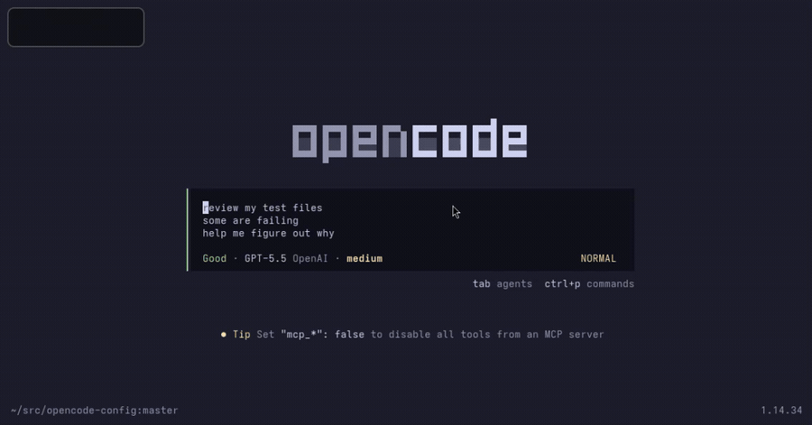

# opencode-vim

Adds Vim-style insert and normal mode editing to the OpenCode prompt.



## Installation

Install from the CLI:

```bash
opencode plugin opencode-vim@latest --global
```

## Supported Keys

| Key                                         | Behavior                                     |
| ------------------------------------------- | -------------------------------------------- |
| `<Esc>`, `<C-[>`                            | Enter normal mode                            |
| `i`, `a`, `A`, `o`, `O`                     | Return to insert mode                        |
| `h`, `j`, `k`, `l`, `w`, `b`, `e`, `$`, `0` | Move through the prompt                      |
| `x`, `d`, `c`, `y`, `p`, `u`, `<C-r>`       | Edit, yank, paste, undo, redo                |
| `v`, `V`                                    | Visual and visual-line selection             |
| `3w`, `diw`, `ci"`, `yiq`, `dip`, `yib`     | Counts and text objects                      |
| `<CR>` in normal mode                       | Submit (default). Configurable via `keymaps` |
| `/vim`                                      | Toggle Vim mode on or off                    |

See [docs/configuration.md](./docs/configuration.md) for configuration options and keymap examples.

中文文档：[README.zh.md](./README.zh.md) | [docs/configuration.zh.md](./docs/configuration.zh.md)
