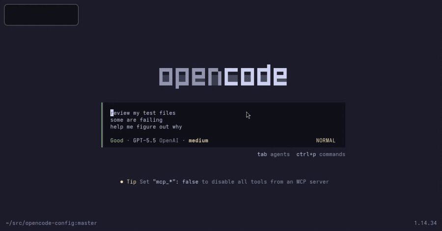

# opencode-vim

Adds Vim-style insert and normal mode editing to the OpenCode prompt.



## Installation

Install from the CLI:

```bash
opencode plugin opencode-vim@latest --global
```

## Supported Keys

| Key | Behavior |
| --- | --- |
| `<Esc>`, `<C-[>` | Enter normal mode |
| `i`, `a`, `A`, `o`, `O` | Return to insert mode |
| `h`, `j`, `k`, `l`, `w`, `b`, `e`, `$`, `0` | Move through the prompt |
| `x`, `d`, `c`, `y`, `p`, `u`, `<C-r>` | Edit, yank, paste, undo, redo |
| `v`, `V` | Visual and visual-line selection |
| `3w`, `diw`, `ci"`, `yiq`, `dip`, `yib` | Counts and text objects |
| `k`, `j` on an empty prompt | Browse previous and next prompts |
| `<CR>` in normal mode | Submit the prompt |
| `/vim` | Toggle Vim mode on or off |

## Custom Keymaps

Keymaps can change modes, submit the prompt, run Vim key sequences, or dispatch active OpenCode commands with the `command:` prefix.

```jsonc
"normal": {
  "Y": "y$",
  "q": "command:session.new"
}
```

See [Keymap Actions](./docs/keymap-actions.md) for available actions and commands, or [Configuration](./docs/configuration.md) for all options.
