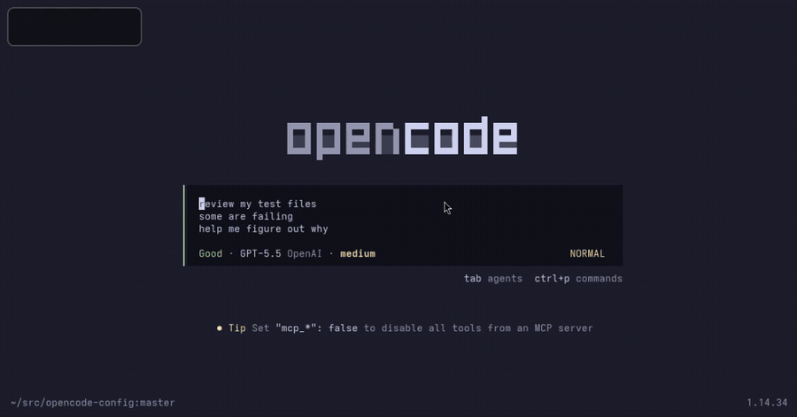

# opencode-vim

Vim-style editing for the OpenCode 2 prompt and dialog search fields, plus a keyboard-driven session reader.



## Installation

Requires OpenCode 2. Install the published plugin:

```sh
opencode plugin add opencode-vim@latest
```

This installs the package and adds it to `~/.config/opencode/cli.json`
(or `$XDG_CONFIG_HOME/opencode/cli.json`). Restart the TUI after installation.

To update:

```sh
opencode plugin update opencode-vim@latest
```

See OpenCode's [plugin installation](https://opencode.ai/v2/docs/plugins#manage)
and [CLI plugin configuration](https://opencode.ai/v2/docs/cli/plugins) docs.

## Supported Keys

Starts in insert mode. Press `Esc` to enter normal mode and `i` to type again.
The current mode appears in the prompt footer. Pending key sequences stay hidden
so they do not shift the layout.

| Key | Behavior |
| --- | --- |
| `Esc`, `Ctrl+[` | Enter normal mode |
| `i`, `a`, `A`, `o`, `O` | Enter insert mode |
| `h`, `l`, `w`, `b`, `e`, `$`, `0` | Move through the prompt |
| `j`, `k`, Up, Down | Move through wrapped rows; counts use actual lines |
| `gj`, `gk`, `g0`, `g^`, `g$` | Move through wrapped screen rows |
| `x`, `d`, `c`, `y`, `p` | Delete, change, yank, and paste |
| `u`, `Ctrl+r`, `.` | Undo, redo, and repeat the last change |
| `v`, `V` | Visual and visual-line selection |
| `3w`, `diw`, `ci"`, `yiq`, `dip`, `yib` | Counts and text objects |
| `k`, `j` on an empty or recalled prompt | Browse previous and next prompts |
| `Enter` in normal mode | Submit the prompt |
| `s` in normal mode | Toggle the session reader |
| `/vim` | Toggle Vim mode on or off |

Navigation follows LazyVim: plain `j`/`k` and Up/Down move through wrapped screen
rows in normal and visual modes. Counts such as `1j` or `3k` move through actual
newline-separated lines; `gj`/`gk` always use screen rows, including with counts.
Wrapping is visual only: `0`/`$`, `A`, `dd`, `yy`, `V`, and operators such as `dj`
still operate on actual lines.
Resizing the prompt does not change its text or undo history.

## Session mode

In an existing session, press `s` from prompt normal mode to navigate the existing
transcript, starting on the latest message each time. Visible messages are
highlighted in place. Off-screen messages scroll into view at the nearest edge,
without extra blank space below the transcript. A colored bar in the left margin
marks the selected message, and a compact prompt-footer hint shows the available keys.
Your prompt text, cursor, and undo history are preserved.

- `j` / `k` or Up / Down: next / previous message; counts work too.
- `gg` / `G`: first / last message. OpenCode loads older history as needed.
- `yy`: copy the entire selected message to the clipboard and Vim's yank register.
- `Enter`: open the selected message's original Markdown in a centered, read-only modal with a cursor.
- `v` / `V`, then motions and `y`: copy characters or whole lines. Yank text can be pasted into the prompt with `p`.
- `Ctrl+d` / `Ctrl+u`: half-page down / up; `Ctrl+f` / `Ctrl+b` or Page Down / Up: full pages.
- `Esc`: clear a text selection, return to the same transcript position, then leave session mode.
- `s`: return directly to prompt normal mode from browsing or idle message normal mode.

The message modal opens only on Enter, with the transcript visible behind it.
While inside a message, streaming text is held still so it cannot move your selection;
returning to the transcript shows the latest text.
Tool-only messages are skipped. Custom normal-mode mappings starting with `s`
take precedence over opening the reader. Prompt editing mappings do not apply inside it.

## Dialogs

Searchable dialogs such as `/models`, the `Ctrl+P` command palette, and Settings
start in your configured `defaultMode`.

- In insert mode, type to filter. `Esc` enters normal mode.
- In normal mode, `j`/`k` select items; `h`/`l`, `x`, `dw`, `u`, and other editing
  commands act on the search text. `i` returns to insert mode.
- `Enter` selects the highlighted item. `Esc` in idle normal mode closes or goes
  back. Arrows, Tab, Home/End, and Page Up/Down keep their dialog behavior.

Dialog editing preserves the main prompt's mode and undo history. Custom normal-mode
mappings take precedence over the dialog `j`/`k` defaults.

## Configuration

Replace the plugin's string entry in `cli.json` with an object to customize it.
This example adds `kj` to leave insert mode, `Y` to yank to the end of the line,
and `q` to start a new session:

```json
{
  "$schema": "https://opencode.ai/v2/cli.json",
  "plugins": [
    {
      "package": "opencode-vim@latest",
      "options": {
        "vim": {
          "defaultMode": "insert",
          "keymapTimeout": 500,
          "keymaps": {
            "insert": { "kj": "normal" },
            "normal": {
              "Y": "y$",
              "q": "command:session.new"
            }
          }
        }
      }
    }
  ]
}
```

`defaultMode` defaults to `insert`; use `normal` to start in normal mode.
`keymapTimeout` is the wait for a multi-key mapping, in milliseconds (default: 500).

Keymaps can use `normal`, `insert`, `submit`, a Vim sequence such as `y$`, or
`command:<id>` for an active [OpenCode command](https://opencode.ai/v2/docs/cli/keybinds).
Mappings are grouped by `insert`, `normal`, `visual`, or `visual-line` mode.
Use notation such as `<Esc>`, `<CR>`, and `<C-s>` for special keys.

Cursor styles can be set under `options.vim.cursorStyles`, for example
`"normal": { "style": "block", "blinking": false }`. Available styles are
`block`, `line`, `underline`, and `default`.
