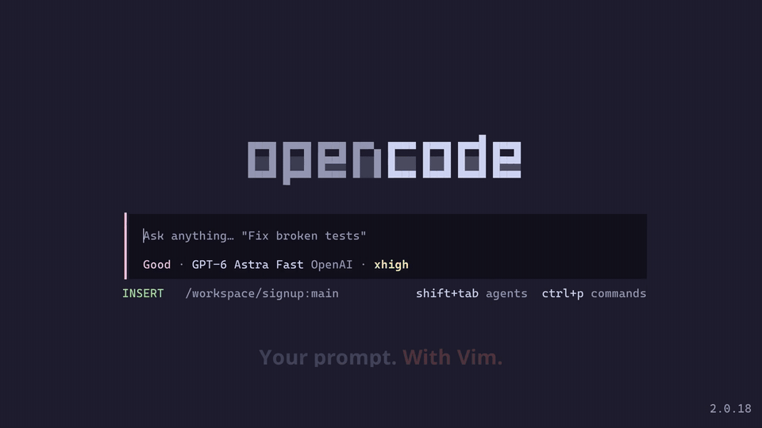

# opencode-vim

Vim-style prompt editing and session navigation for OpenCode 2.



## Installation

```sh
opencode plugin add opencode-vim@latest
```

## Updating

```sh
opencode plugin update opencode-vim@latest
```

Restart the terminal UI after updating to load the new version.

## Usage

Press `Esc` to enter normal mode and `i` to type again in insert mode.

In a session, press `s` from normal mode to browse messages and tools. Use `j`/`k`
to navigate, `Enter` to open an item, and `s` to return to the prompt.

Use `/vim` to toggle the plugin on or off.

## Development

Run `npm ci` and `bun run build` before loading this checkout as a local plugin.
Rebuild after changing source files. The published entrypoint compiles JSX and
uses OpenCode's shared UI runtime.

`bun run test` checks both source loading and the packed npm plugin under
`node_modules`, including mode updates, session browsing, clipboard and cleanup.

## Documentation

- [Keybindings and modes](./docs/vim-behavior.md)
- [Configuration](./docs/configuration.md)
- [Custom keymaps](./docs/keymap-actions.md)
